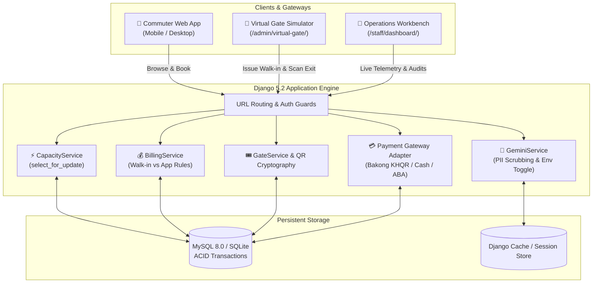

<div align="center">

```
 ███████╗ ██████╗ ███╗   ███╗██████╗  █████╗ ██████╗ ██╗  ██╗
 ██╔════╝██╔═══██╗████╗ ████║██╔══██╗██╔══██╗██╔══██╗██║ ██╔╝
 ███████╗██║   ██║██╔████╔██║██████╔╝███████║██████╔╝█████╔╝ 
 ╚════██║██║   ██║██║╚██╔╝██║██╔═══╝ ██╔══██║██╔══██╗██╔═██╗ 
 ███████║╚██████╔╝██║ ╚═╝ ██║██║     ██║  ██║██║  ██║██║  ██╗
 ╚══════╝ ╚═════╝ ╚═╝     ╚═╝╚═╝     ╚═╝  ╚═╝╚═╝  ╚═╝╚═╝  ╚═╝
```

# SomPark • ចំណតឆ្លាតវៃ រាជធានីភ្នំពេញ
### *Enterprise-Grade Smart Parking & Virtual Gate Telemetry Engine for Phnom Penh Capital*

[](https://www.python.org/)
[](https://www.djangoproject.com/)
[](https://www.mysql.com/)
[](https://bakong.nbc.gov.kh/)
[-F59E0B?style=for-the-badge)](https://www.nbc.gov.kh/)
[](LICENSE)

<p align="center">
  <a href="#-key-features"><b>Features</b></a> •
  <a href="#-system-architecture"><b>Architecture</b></a> •
  <a href="#-live-interface-directory"><b>Portals</b></a> •
  <a href="#-quick-start-guide-windows-powershell"><b>Quick Start</b></a> •
  <a href="#-walk-in-parking--gate-simulator"><b>Virtual Gate</b></a> •
  <a href="#-gemini-ai-assistant--feature-flag"><b>AI Assistant</b></a> •
  <a href="#-billing-engine--pricing-rules"><b>Billing Engine</b></a> •
  <a href="#-automated-testing--qa"><b>Testing</b></a>
</p>

---

</div>

## 🌟 Executive Overview

**SomPark (ចំណតឆ្លាតវៃ រាជធានីភ្នំពេញ)** is a modern, high-concurrency smart parking management and virtual barrier telemetry platform engineered specifically for Phnom Penh Capital. 

Designed to eliminate congestion in high-density districts (*BKK1, Riverside / Daun Penh, Toul Kork, Sen Sok*), SomPark blends real-time IoT gate simulation with advance app reservations, dual-stream billing engines, thermal QR ticket printing, and optional Google Gemini AI assistance — all adhering to Cambodian regulatory, financial, and vehicular standards.

---

## ⚡ Key Features

<table>
  <tr>
    <td width="50%">
      <h3>🚗 Walk-In Parking & Instant Gate Tickets</h3>
      <ul>
        <li><b>Instant Entrance Dispenser</b>: Issue walk-in tickets at the virtual gate with a single click — no app account, phone number, or pre-booking required.</li>
        <li><b>Daily Walk-in Rates</b>: Configurable per-facility walk-in rate (default <code>7,000 ៛/day</code>) with mandatory rate confirmation modal before issuing.</li>
        <li><b>Thermal QR Ticket</b>: Generates high-contrast, printable receipts with embedded cryptographic QR codes, unique ticket IDs (<code>SPK-W...</code>), and rate snapshots.</li>
        <li><b>Fair Billing</b>: Billed in 24-hour blocks from actual vehicle entry with zero overstay penalties.</li>
      </ul>
    </td>
    <td width="50%">
      <h3>📱 Mobile App Reservations & Digital Passes</h3>
      <ul>
        <li><b>Advance Spot Guarantee</b>: Pre-book guaranteed bays up to 7 days ahead with customizable durations.</li>
        <li><b>Flexible Checkout</b>: Choose between <i>"Pay first day now"</i> (guaranteed arrival window) or <i>"Pay when you leave"</i>.</li>
        <li><b>In-App Customer Exit Payment</b>: Pay pending balances directly from the customer dashboard via Bakong KHQR, Cash, or Demo ABA.</li>
        <li><b>Live Digital Pass</b>: Dynamic status badges, arrival countdown clocks, Google Maps directions, and high-contrast access QR codes.</li>
      </ul>
    </td>
  </tr>
  <tr>
    <td width="50%">
      <h3>🚧 Virtual Barrier & Telemetry Simulator</h3>
      <ul>
        <li><b>Full-Duplex Gate Console</b>: Toggle seamlessly between Entrance and Exit terminals at <code>/admin/virtual-gate/</code>.</li>
        <li><b>Animated Physical Barriers</b>: Realistic servo-actuated boom barrier arm with synced green/red LED status beacons.</li>
        <li><b>Vehicle Drive-Through Simulation</b>: Dynamic vehicle pathing animation (upward for entry, downward for departure).</li>
        <li><b>Sticky HUD Architecture</b>: Real-time telemetry sensors, live camera scanner, and reservation ledger remain pinned in viewport during scroll.</li>
      </ul>
    </td>
    <td width="50%">
      <h3>🤖 Gemini AI Smart Parking Concierge</h3>
      <ul>
        <li><b>Bilingual Conversational AI</b>: Fluent in Khmer and English to guide drivers to optimal spots by district, price, and operating hours.</li>
        <li><b>Zero-Leak Security Guard</b>: Strict server-side sanitization, PII scrubbing (plates, phones, QR tokens), and rate limiting.</li>
        <li><b>Instant Environment Kill-Switch</b>: Turn the entire assistant UI and API off instantly with <code>gemini_ai=false</code> in <code>.env</code>.</li>
        <li><b>Quota Protected</b>: Zero unauthorized API drain; graceful fallback handling when disabled or offline.</li>
      </ul>
    </td>
  </tr>
  <tr>
    <td width="50%">
      <h3>🇰🇭 Cambodian Localization & Compliance</h3>
      <ul>
        <li><b>Official Currency (៛ KHR)</b>: All pricing, deposits, balances, and receipts strictly computed and displayed in Cambodian Riel.</li>
        <li><b>Cambodian License Plate Engine</b>: Validates standard (<code>1A-1234</code>, <code>2AB-1234</code>), provincial (<code>ភ្នំពេញ 2AB-1234</code>), and state/special plates (<code>រដ្ឋ 01 2-3456</code>).</li>
        <li><b>National Telco Phone Regex</b>: Supports 9-to-10 digit Cambodian phone prefixes (Smart <code>010/098</code>, Cellcard <code>012/077</code>, Metfone <code>097/088</code>).</li>
      </ul>
    </td>
    <td width="50%">
      <h3>🛡️ ACID Concurrency & Zero Overselling</h3>
      <ul>
        <li><b>Row-Level Database Locking</b>: Employs <code>select_for_update()</code> to guarantee atomic slot reservation during high-concurrency spikes.</li>
        <li><b>Combined Capacity Calculation</b>: Physical occupancy, active app holds, and unentered walk-in tickets are unified in real-time.</li>
        <li><b>Resilient Database Tiering</b>: Automatic fallback across Local MySQL, Cloud Aiven MySQL (SSL/TLS), and zero-config SQLite.</li>
      </ul>
    </td>
  </tr>
</table>

---

## 🏗️ System Architecture



---

## 🧭 Live Interface Directory

Once the local server is running at `http://127.0.0.1:8000/`, access the primary interfaces:

| Portal | Route | Primary Role | Description & Key Functions |
|---|---|---|---|
| **Public Portal & Finder** | [`/`](http://127.0.0.1:8000/) | Public / Driver | Interactive zone map, live vacant spots, rates in KHR, and booking engine. |
| **Customer My Tickets** | [`/ticket/`](http://127.0.0.1:8000/ticket/) | Customer | Active reservations, digital QR access pass, arrival countdown, and exit settlement. |
| **Virtual Parking Gate** | [`/admin/virtual-gate/`](http://127.0.0.1:8000/admin/virtual-gate/) | Gate Operator / Staff | Dual-mode simulator (Walk-in dispenser, camera QR scanner, boom barrier, vehicle animation). |
| **Operations Workbench** | [`/staff/dashboard/`](http://127.0.0.1:8000/staff/dashboard/) | Staff / Attendant | Facility occupancy telemetry, rapid ticket search, and real-time vehicle ledger. |
| **Django Administration** | [`/admin/`](http://127.0.0.1:8000/admin/) | Superuser / Admin | Full database management, zone pricing, user permissions, and audit logs. |

---

## 🚀 Quick Start Guide (Windows PowerShell)

Follow these step-by-step instructions to set up and run SomPark using a local MySQL database on Windows.

### Prerequisites
- **Python**: 3.10, 3.11, 3.12, 3.13, or 3.14
- **MySQL Server**: 8.0+ (Standalone MySQL Community Server or XAMPP)
- Modern web browser (Chrome, Edge, Firefox, Brave)

---

### Step 1: Open PowerShell and Navigate to Project
```powershell
cd e:\Python\Parking-Slot-MGM
```

### Step 2: Create and Activate Virtual Environment
```powershell
python -m venv venv
.\venv\Scripts\Activate.ps1
```
> *Tip: If PowerShell blocks script execution, run: `Set-ExecutionPolicy -Scope Process -ExecutionPolicy Bypass`*

### Step 3: Install Required Dependencies
```powershell
pip install -r requirements.txt
```

### Step 4: Configure Environment Variables
Copy the template configuration to create your local `.env`:
```powershell
Copy-Item .env.example .env
```

Generate a private Django cryptographic key:
```powershell
python -c "import secrets; print(secrets.token_urlsafe(48))"
```
Paste this string into `SECRET_KEY=` in `.env`.

Verify your **Local MySQL** settings in `.env`:
```env
DB_CONNECTION=mysql
DB_HOST=127.0.0.1
DB_PORT=3306
DB_DATABASE=my_app_db
DB_USERNAME=root
DB_PASSWORD=secret
DB_CONN_MAX_AGE=60
```
- Replace `secret` with your local MySQL password (or leave empty `DB_PASSWORD=` if none).
- If your password contains `#`, special characters, or spaces, enclose it in quotes: `DB_PASSWORD="p#ss word"`.
- Keep `MYSQL_SSL_CA` empty for local MySQL.

### Step 5: Start MySQL & Create the Database
Ensure your MySQL service is running, then create the database:
```powershell
mysql -u root -p -e "CREATE DATABASE IF NOT EXISTS my_app_db CHARACTER SET utf8mb4 COLLATE utf8mb4_unicode_ci;"
```
*(Omit `-p` if your root user has no password)*

### Step 6: Run Migrations, Seeder, and Superuser
```powershell
# 1. Validate configuration and dependencies
python manage.py check

# 2. Apply database migrations
python manage.py migrate

# 3. Seed Phnom Penh parking facilities and test accounts (Idempotent)
python manage.py seed_demo

# 4. Create an administrator account
python manage.py createsuperuser

# 5. Start the development server
python manage.py runserver
```

Open your browser at **`http://127.0.0.1:8000/`** to explore SomPark!

---

## 👥 Seeded Demo Accounts & Credentials

The `python manage.py seed_demo` command is **safe and idempotent** — run it anytime without corrupting or deleting existing records:

| Role | Username | Password | Pre-seeded Context |
|---|---|---|---|
| **System Administrator** | `admin` | *(Created via createsuperuser)* | Access to `/admin/` and `/admin/virtual-gate/`. |
| **Registered Customer** | `demo` | `password123` | Commuter with 3 lifecycle sample tickets pre-loaded in `/ticket/`. |
| **Sample Ticket 1** | `SPK-DEMO001` | — | **CONFIRMED**: Unpaid advance hold with active 3-hour arrival deadline. |
| **Sample Ticket 2** | `SPK-DEMO002` | — | **CHECKED_IN**: Active parked vehicle in BKK1 with deposit paid. |
| **Sample Ticket 3** | `SPK-DEMO003` | — | **CHECKED_OUT**: Completed historical stay with itemized bill. |

---

## 🎟️ Walk-In Parking & Gate Simulator

The **Virtual Gate Simulator** (`/admin/virtual-gate/`) provides a complete physical terminal experience:

```
+-----------------------------------------------------------------------------------+
|  [ 入 Entrance Mode ]                                     [ 出 Exit Mode ]        |
+------------------------------------------+----------------------------------------+
|  WALK-IN TICKET DISPENSER                |  VIRTUAL BARRIER & ROADWAY TELEMETRY   |
|  Facility: BKK1 Commercial Plaza         |  +----------------------------------+  |
|  Walk-in Rate: 7,000 KHR / day           |  | Status: BARRIER CLOSED [RED LED] |  |
|  Simulated Plate: [ 2BC-8899         ]   |  | Barrier Arm: ══════════════════  |  |
|  [ 🎫 Get Walk-In Ticket ]               |  | [🚗] Approaching Vehicle         |  |
|                                          |  +----------------------------------+  |
|  1. Review rate confirmation modal.      |  [ 🚗 Confirm Vehicle Entry ]          |
|  2. View / Print thermal QR receipt.     |  - Animates vehicle through gate.      |
|  3. Barrier opens automatically.         |  - Lowers barrier arm smoothly.        |
|  4. Confirm vehicle passage.             |  - Atomically increments occupancy.    |
+------------------------------------------+----------------------------------------+
```

### Operational Workflow:
1. **Issuing a Walk-In Ticket**:
   - Operator selects **Entrance Mode** and clicks **"Get Walk-in Ticket"**.
   - A modal requires confirmation of the daily walk-in rate (e.g., `7,000 ៛/day`).
   - SomPark performs atomic capacity check: guarantees slots are available without violating reserved holds.
   - Issues printable thermal QR ticket modal and signals the barrier to open.
2. **Vehicle Entry Passage**:
   - The green glowing button **"🚗 Confirm Vehicle Entry & Close Barrier (ឡានចូលរួច)"** lights up.
   - Clicking it triggers a smooth vehicle upward driving animation, lowers the barrier arm, and officially starts the parking clock (`checked_in_at = now`).
3. **Exit Settlement & Departure**:
   - Operator switches to **Exit Mode** and inputs/scans the ticket QR code.
   - Settle any remaining balance via **Cash** or **Demo ABA QR**.
   - Upon payment settlement, the barrier arm immediately lifts and the departure button appears.
   - Clicking **"🚗 Confirm Vehicle Departure & Close Barrier (ឡានចេញរួច)"** drives the vehicle downward out of the facility, lowers the barrier arm, and releases capacity back to the city!

---

## 🤖 Gemini AI Assistant & Feature Flag

SomPark features an intelligent AI assistant capable of recommending Phnom Penh parking facilities based on live vacancies, price points, and operating hours.

```
+-----------------------------------------------------------------------------------+
| ✦ GEMINI AI Smart Parking Assistant (ជំនួយការឆ្លាតវៃ)                            |
| Ask our AI assistant to find the ideal parking spot across Phnom Penh...          |
| [ Find parking near Riverside promenade with available slots.        ] [Ask Gemini|
+-----------------------------------------------------------------------------------+
```

### Instant Environment Toggle (`gemini_ai=false`)
You have full control over the AI assistant via your `.env` file:

```env
# Disable Gemini AI: Hides UI card from homepage & blocks direct API access with HTTP 403
gemini_ai=false

# Re-enable Gemini AI:
gemini_ai=true
```

- **Case-Insensitive & Flexible**: Supports `gemini_ai=false`, `GEMINI_AI=false`, or `GEMINI_AI_ENABLED=0/no/off`.
- **Zero Frontend Clutter**: When disabled, `#ai-assistant-section` and its client JavaScript are completely omitted from the HTML DOM.
- **Strict API Guard**: Direct `POST /api/ai-assistant/` requests are immediately rejected with `403 Forbidden` (`AI_ASSISTANT_DISABLED`).
- **Data Privacy**: Customer phone numbers, license plates, and cryptographic QR tokens are permanently scrubbed before any prompt reaches the AI model.

---

## 💰 Billing Engine & Pricing Rules

SomPark strictly isolates walk-in ticketing from advance app bookings to prevent unfair penalties:

| Billing Dimension | 🚗 Walk-In Parking | 📱 Advance App Reservation |
|---|---|---|
| **Rate Basis** | Facility Walk-in Rate (`walk_in_price`, default `7,000 ៛/day`). | Facility Base Rate (`price`, e.g. `3,000 – 4,000 ៛/day`). |
| **Billing Increment** | Strict 24-hour calendar blocks from physical gate entry. | Pre-booked duration (`reserved_days`) chosen by customer. |
| **Minimum Charge** | **1 full day minimum** once vehicle crosses the barrier. | **1 full day** (deposit paid at booking or on arrival). |
| **Unentered Hold Charge**| **0 KHR** (holds auto-expire; no charge if vehicle never enters). | **0 KHR** for pay-later; deposit refunded if cancelled in time. |
| **Overstay Multiplier** | **None** (`1.0x` standard daily rate for each new 24h block). | **2.0x Multiplier** applied after reserved duration expires. |
| **Billing Label** | Clearly itemized as **`"Walk-in rate"`** on receipts. | Itemized as **`"Base Rate"`** + **`"Overstay Penalty"`**. |

---

## ⚙️ Environment Variables Matrix

| Category | Variable | Required | Default | Description |
|---|---|---|---|---|
| **Django** | `DEBUG` | No | `True` | Set to `False` for production deployments. |
| | `SECRET_KEY` | **Yes** | — | Cryptographic secret for signing tokens and sessions. |
| | `ALLOWED_HOSTS` | No | `localhost,127.0.0.1` | Comma-separated allowed hostnames and domains. |
| **Database** | `DB_CONNECTION` | No | `sqlite` | Set `mysql` for local/cloud MySQL; unset for SQLite fallback. |
| | `DB_HOST` | If MySQL | `127.0.0.1` | Hostname/IP of MySQL database server. |
| | `DB_PORT` | No | `3306` | MySQL port. |
| | `DB_DATABASE` | If MySQL | `my_app_db` | Target database name. |
| | `DB_USERNAME` | If MySQL | `root` | Database username. |
| | `DB_PASSWORD` | No | `""` | Database password (enclose in quotes if special characters). |
| | `DATABASE_URL` | No | — | Cloud MySQL URI (e.g. Aiven MySQL with SSL). |
| **AI & Feature Flags** | `gemini_ai` / `GEMINI_AI` | No | `true` | Set `false` to hide assistant UI card and disable API. |
| | `GEMINI_API_KEY` | Optional | `""` | Google Gemini API key (server-side only). |
| | `GOOGLE_MAPS_API_KEY` | Optional | `""` | Client-side Google Maps JavaScript API key. |
| **Payment & Holds** | `DEMO_PAYMENT_ENABLED` | No | `True` | Enables interactive Bakong KHQR and ABA demo simulators. |
| | `ARRIVAL_HOLD_HOURS` | No | `3` | Arrival window in hours for "Pay when you leave" holds. |
| | `DEPOSIT_ARRIVAL_HOLD_HOURS`| No | `5` | Arrival window in hours after first-day deposit is paid. |
| | `DEFAULT_OVERSTAY_MULTIPLIER`| No | `2.0` | Overstay multiplier applied after app booking expires. |

---

## 🧪 Automated Testing & QA

SomPark includes an extensive, zero-mock regression and concurrency test suite:

```powershell
# Run the complete test suite
python manage.py test --keepdb

# Target specific modules
python manage.py test --keepdb parking_zones.test_gemini_backend
python manage.py test --keepdb parking_zones.test_gemini_env_flag
python manage.py test --keepdb parking_zones.test_gate_machine
python manage.py test --keepdb parking_zones.test_walk_in_parking
python manage.py test --keepdb parking_zones.test_customer_checkout_enforcement
```

### Test Coverage Highlights:
- **Walk-in Lifecycle**: Verifies capacity holds, rate snapshots, gate openings, entry passage updates, and exit fee calculations.
- **Virtual Gate Concurrency**: Validates atomic row locking, barcode/QR token verification, and vehicle passage events.
- **Gemini AI Security**: Verifies that `gemini_ai=false` suppresses the UI card, returns 403 on API routes, and scrubs PII.
- **Customer Checkout Enforcement**: Validates that unpaid exit balances strictly prevent checkout until settled.

---

## 🛡️ Production Deployment Readiness

When deploying SomPark to cloud environments (Google Cloud Run, AWS ECS, DigitalOcean, Ubuntu VPS):

1. **Production Settings**:
   ```env
   DEBUG=False
   ALLOWED_HOSTS=sompark.kh,api.sompark.kh
   ```
2. **Collect Static Assets**:
   ```bash
   python manage.py collectstatic --noinput
   ```
3. **Background Expiry Worker**:
   Schedule the cleanup worker to run every 2 minutes to auto-release expired unpaid holds:
   ```bash
   python manage.py expire_reservations
   ```
4. **WSGI / ASGI Server**:
   ```bash
   gunicorn parking_management.wsgi:application --workers 4 --bind 0.0.0.0:8000
   ```

---

<div align="center">

**SomPark (ចំណតឆ្លាតវៃ រាជធានីភ្នំពេញ)** • *Crafted with ❤️ for Phnom Penh Capital*

[](https://en.wikipedia.org/wiki/Phnom_Penh)

</div>
